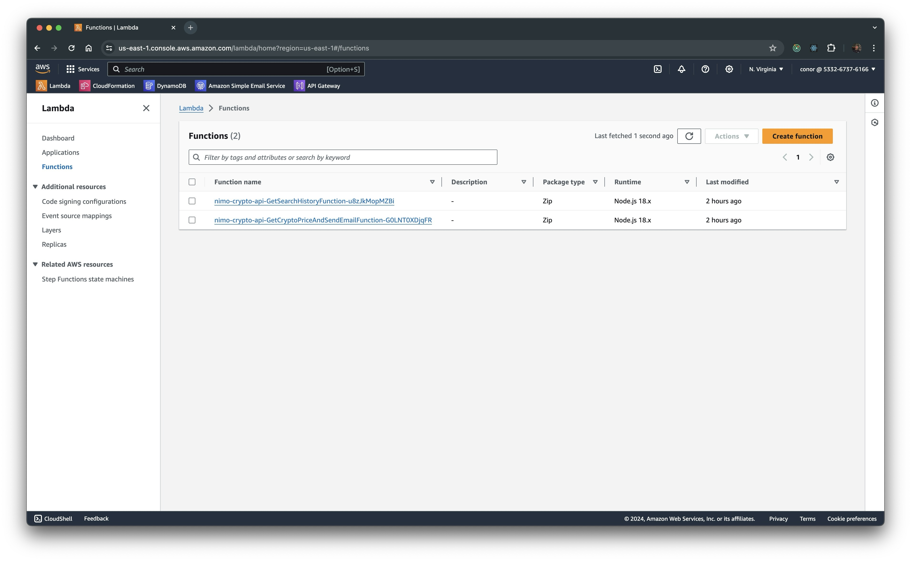
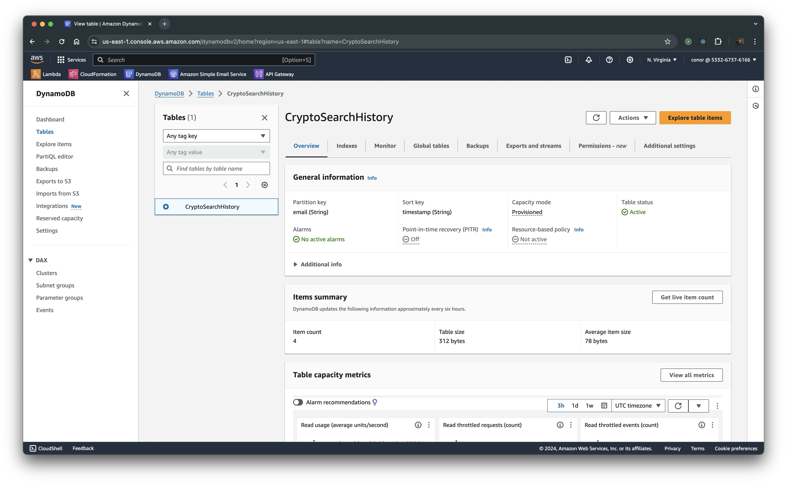

# Nimo Industries Techincal Test 🚀 

Hey there 👋 Thanks for taking the time to code review my work - looking forward to your feedback 🙂

This project sets up a serverless architecture using AWS SAM (Serverless Application Model) for a cryptocurrency price tracking and email notification API. The service includes Lambda functions for fetching cryptocurrency prices and managing search history.

## Architecture

The SAM template provisions the following AWS resources:
1. **Lambda Functions**:
   - `GetCryptoPriceAndSendEmailFunction`: Fetches the cryptocurrency price from CoinGecko and sends an email to the user via AWS SES.
   - `GetSearchHistoryFunction`: Retrieves all search history from DynamoDB.



2. **DynamoDB Table**:
   - `CryptoSearchHistoryTable`: Stores the search history records.




## CICD
Github Actions is used to automatically deploy resources to AWS after a succesful merge of dev into main. 

### Notes
- AWS SES is used to send emails. At the moment, my personal email (cshirren@gmail.com) and a demo email account have been pre-validated as known identities for AWS SES - this is required as my AWS Account is in a Sandbox Env. The below email account can be used to test the API endpoints and view subsequent emails. 
    - email: conorshirren.nimo@gmail.com
    - password: conorshirren

    


### Further Improvements
I do understand that this solution is far from perfect. If I was to spend more time developing this solutions further, I would focus on the following areas:
- Improve API schema/error responses for better client experience
- Improve use of middleware for error handling and logging
- Add proper auth using JWT to protect the API.
- Review resources performance and perform cost optimization
- Add rate limiting protection to the API, along with improving the searchHistory API to return paginated data/query by email.
- Improve on project structure and layout

# Getting Started

To run the project locally you will need to:
1. Clone the repository:
```bash
   git clone <repository-url>
```

2. Install dependencies:
```bash
cd nimo-crypto-api
npm install
```

3. Build using SAM:
```bash
sam build
```

4. Run using SAM:
```bash
sam local start-api 
```

## Endpoints

#### getCryptoPrice API
This API endpoint can be hit with a POST request at: https://6oq24e3utf.execute-api.us-east-1.amazonaws.com/Stage/getCryptoPrice
- It exptects the following body:
```json
{
    "email": "conorshirren.nimo@gmail.com",
    "crypto": "bitcoin"
}
```

#### getSearchHistory
This API endpoint can be hit with a POST request at: https://6oq24e3utf.execute-api.us-east-1.amazonaws.com/Stage/getSearchHistory
- No request body is required

## Testing

### Unit Testing
Run unit tests with Jest:

```bash
npm test
```
### Testing via Postman

I have also provided a simple postman collection that can be easily imported to manually test the API. This can be found at `postman/Nimo Developer Test.postman_collection.json`


---