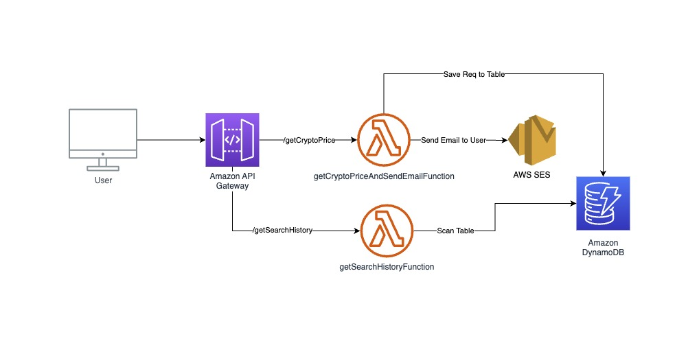
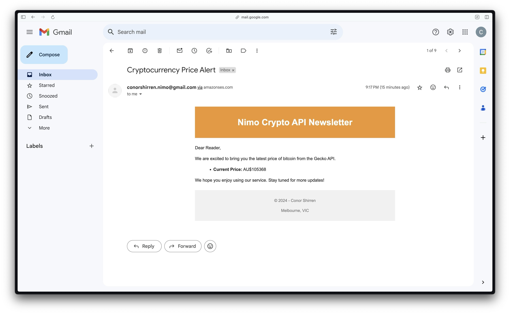
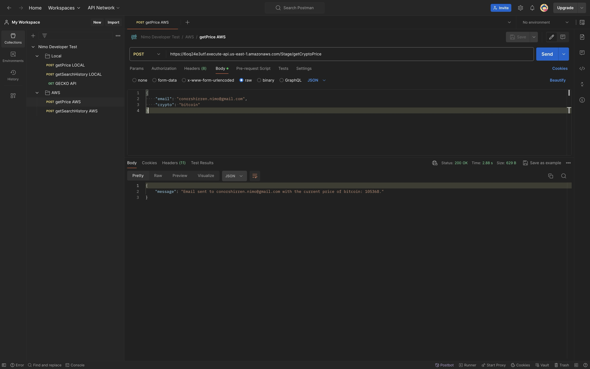

# Nimo Industries Techincal Test 🚀 

Hey there 👋 Thanks for taking the time to code review my work - looking forward to your feedback 🙂

## Architecture

The SAM template provisions the following AWS resources:
1. **API Gateway** to access lambda functions.
2. **Lambda Functions**:
   - `GetCryptoPriceAndSendEmailFunction`: Fetches the cryptocurrency price from CoinGecko and sends an email to the user via AWS SES.
   - `GetSearchHistoryFunction`: Retrieves all search history from DynamoDB.
3. **DynamoDB Table**:
   - `CryptoSearchHistoryTable`: Stores the search history records.


   


## CICD
Github Actions is used to automatically deploy resources to AWS after a succesful merge of dev into main. 

```yml
name: Deploy SAM Application on merge to main

on:
  pull_request:
    types: [closed]
    branches:
      - main

jobs:
  deploy:
    if: github.event.pull_request.merged == true
    runs-on: ubuntu-latest

    steps:
      - name: Checkout repository
        uses: actions/checkout@v2

      - name: Set up Node.js
        uses: actions/setup-node@v3
        with:
          node-version: '20.x'

      - name: Set up SAM CLI
        uses: aws-actions/setup-sam@v1

      - name: Configure AWS credentials
        uses: aws-actions/configure-aws-credentials@v1
        with:
          aws-access-key-id: ${{ secrets.AWS_ACCESS_KEY_ID }}
          aws-secret-access-key: ${{ secrets.AWS_SECRET_ACCESS_KEY }}
          aws-region: us-east-1

      - name: Build SAM application
        run: sam build

      - name: Deploy SAM application
        run: sam deploy --no-confirm-changeset --no-fail-on-empty-changeset --stack-name nimo-crypto-api --region us-east-1 

```

### Notes
- AWS SES is used to send emails. At the moment, my personal email (cshirren@gmail.com) and a demo email account have been pre-validated as known identities for AWS SES - this is required as my AWS Account is in a Sandbox Env. The below email account can be used to test the API endpoints and view subsequent emails. If you have any issues accessing this mailbox, please contact me at cshirren@gmail.com. 
    - email: conorshirren.nimo@gmail.com
    - password: conorshirren

    


### Further Improvements
I do understand that this solution is far from perfect. If I was to spend more time developing this solution, I would focus on the following areas:
- Better Function and API Route naming in AWS
- Improve API schema/error responses for better client experience
- Improve use of middleware for error handling and logging
- Add proper auth using JWT to protect the API.
- Review resources performance and perform cost optimization
- Add rate limiting protection to the API, along with improving the searchHistory API to return paginated data/query by email.
- Improve on project structure and layout
- Deploy Swagger UI API docs and serve via S3 - looked into starting this as can be seen from commits but due to other work commitments and time constraints I had to remove prior to submission. I have included my swagger doc in the `/docs` directory if you wish to copy this into [swagger.io](https://editor.swagger.io/)

# Getting Started

To run the project locally you will need to:
1. Clone the repository:
```bash
   git clone <repository-url>
```

2. Install dependencies:
```bash
   cd nimo-crypto-api
   npm install
```

3. Build using SAM:
```bash
   sam build
```

4. Run using SAM:
```bash
   sam local start-api 
```

> Note: You may need your own AWS Account and user with relavant IAM permissions/Access Keys if you want to thoroughly test this project in AWS.

## Endpoints

#### getCryptoPrice API
This API endpoint can be hit with a POST request at: https://6oq24e3utf.execute-api.us-east-1.amazonaws.com/Stage/getCryptoPrice
- It expects the following body:
```json
   {
      "email": "conorshirren.nimo@gmail.com",
      "crypto": "bitcoin"
   }
```

#### getSearchHistory
This API endpoint can be hit with a GET request at: https://6oq24e3utf.execute-api.us-east-1.amazonaws.com/Stage/getSearchHistory
- No query params are required

## Testing

### Testing via Postman

I have also provided a simple postman collection that can be easily imported to manually test the API. This can be found at `postman/Nimo Developer Test.postman_collection.json`



---